 

&nbsp;&nbsp;<a href="https://github.com/irg1008/holocron">holocron</a> &nbsp;·&nbsp;
<a href="https://github.com/irg1008/la-sella">la-sella</a> &nbsp;·&nbsp;
<a href="https://github.com/irg1008/pr-bro">pr-bro</a> &nbsp;·&nbsp;
<a href="https://github.com/irg1008/pop-with-bob">pop-with-bob</a> &nbsp;·&nbsp;
<a href="https://github.com/irg1008/Sign2Text">Sign2Text</a> &nbsp;·&nbsp;
<a href="https://the.fotoapp.co/gazquez">the.fotoapp.co/gazquez</a> &nbsp;·&nbsp;
<a href="mailto:ivansudevlop@gmail.com">email</a>

