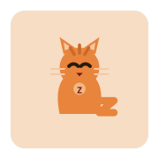
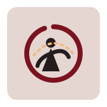
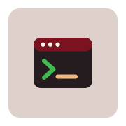

```console
$ neofetch

ivan@burgos
-----------
role      full-stack engineer — web platforms, DB to design system
company   Oxygent Technologies
stack     TypeScript · React · Astro · Tailwind · shadcn/ui
services  .NET · Go · PostgreSQL · Prisma
infra     Docker · Kubernetes · CI/CD · self-hosted homelab
ml        CNN / NLP — PyTorch, ONNX, FastAPI
play      Godot + GDShader
since     2019 · CS, University of Burgos
```

### `$ ls ~/projects --sort=recent`

| repo | what it is | |
|:--|:--|:--|
| [**holocron**](https://github.com/irg1008/holocron) | self-hostable, lightweight BookLore alternative | `ts` |
| [**la-sella**](https://github.com/irg1008/la-sella) | site + booking for El Rincón de La Sella | `ts·astro` |
| [**pr-bro**](https://github.com/irg1008/pr-bro) | workout tracker for lifters — PRs, routines, 3D panda | `astro·r3f` |
| [**pop-with-bob**](https://github.com/irg1008/pop-with-bob) | Godot game — C# + GDShader | `gd·c#` |
| [**Sign2Text**](https://github.com/irg1008/Sign2Text) | ASL → text — CNN, ONNX, FastAPI | `py` |

### `$ cat ~/off-the-clock.md`

<p>
  &nbsp;
  &nbsp;
  &nbsp;
  &nbsp;
  &nbsp;
  
</p>

- **piano** — mostly classical, occasionally in tune
- **aikido** — on the mat most weeks
- **photography** — [the.fotoapp.co/gazquez](https://the.fotoapp.co/gazquez)
- **gamedev** — Godot jams and shader rabbit-holes
- **Z** — the orange cat, unpaid project manager

### `$ contact`

- **github** — [github.com/irg1008](https://github.com/irg1008)
- **email** — `ivansudevlop@gmail.com`
- **foto** — [the.fotoapp.co/gazquez](https://the.fotoapp.co/gazquez)

---


